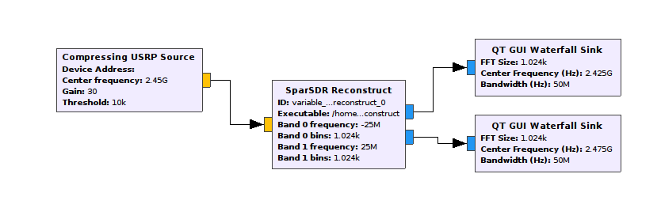

# SparSDR

This code accompanies the paper [*SparSDR: Sparsity-proportional Backhaul and Compute for SDRs*](https://cseweb.ucsd.edu/~schulman/docs/mobisys19-sparsdr.pdf).

## What's included

* FPGA images that enable the USRP N210 or Analog Devices ADALM-PLUTO to capture a wide range of frequencies and
send compressed signals
* The `sparsdr_reconstruct` program, which reconstructs signals from compressed data
* The `gr-sparsdr` module for GNU Radio, which makes SparSDR easy to use

## Getting started

* [Pluto getting started guide](doc/getting_started_pluto.md)
* [USRP N2101 getting started guide](doc/getting_started_pluto.md)

## Debugging

When SparSDR does not work correctly, [the debugging guide](doc/debugging.md) may help.

## Compatibility

We have tested SparSDR with GNU Radio 3.8.2.0.

SparSDR should work with any GNU Radio version in the 3.8 series.

### Pluto SDR

SparSDR  works with the Analog Devices ADALM-PLUTO radio. We have tested hardware revisions B and C.

### USRP N210

We have tested SparSDR with a USRP N210 revision 4 with an SBX-120 or a CBX-120 daughter board.

This repository includes one FPGA image for the USRP N210 revision 4, and a separate FPGA image for N210 revisions 2 and 3.

Daughter boards other than the SBX-120 should also work, with the following considerations:

* If the daughter board receive bandwidth is less than 100 MHz, this will limit what you can receive with SparSDR
* If the daughter board receive bandwidth is greater than 100 MHz, you may see aliasing because the signal will still be sampled at 100 million samples per second.

## Licenses

* `gr-sparsdr`: GNU GPL v3 or later
* `fpga_images/Pluto`: GNU GPL 2
* `fpga_src/Pluto`: GNU GPL v2 or Apache 2.0
* `fpga_images/N210` and `fpga_src/N210`: GNU GPL v3 or later
* Everything else: Apache 2.0
